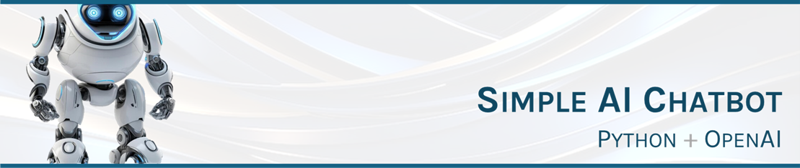

This repository has a number of Python files, each one independent of each other. It provides one of the most simplest code to create an AI chatbot.
<br><br>

# Artifacts
The following files are included in this repository.
| Filename | Language | Backend | Connection Type | Comments |
| :-- | :-- | :-- | :-- | :-- |
| chatbot_openai_sync_old.py | Python | OpenAI | Synchronous | Uses older openai==0.28 Python module (Aug 2023) |
| chatbot_openai_sync.py | Python | OpenAI | Synchronous | Uses openai==1.61.1 Python module (Feb 2025) |
| chatbot_openai_async.py | Python | OpenAI | Asynchronous | Uses openai==1.61.1 (Feb 2025); handles longer response times from OpenAI |
| chatbot_azureopenai_sync_old.py | Python | Azure OpenAI | Synchronous | Uses older openai==0.28 Python module (Aug 2023) |
| chatbot_azureopenai_sync.py | Python | Azure OpenAI | Synchronous | Uses openai==1.61.1 Python module (Feb 2025) |
| chatbot_azureopenai_async.py | Python | Azure OpenAI | Asynchronous | Uses openai==1.61.1 (Feb 2025); handles longer response times from OpenAI |
<br>

# Installation

1. Download and install <a href="https://www.python.org/downloads/">Python</a>$\textcolor{silver}{↗}$
2. From the command line, install the Python module _openai_ using one of the following:
```
# Install latest openai
pip3 install openai

# Install older version of openai (if using the older code in this repo)
pip3 install openai==0.29

# Install the specific version of openai used in this code
pip3 install openai==1.61.1
```
3. Download one of the files in this repository
4. Replace the value of _api_key_ in the code with your OpenAI API key (or Azure OpenAI details)
<br>

# Usage

The code can be executed from the command line using `python <filename>` as shown:<br><br>


Or it can be run directly from your IDE (Visual Studio Code is shown here):<br><br>

<br><br>

# References

* OpenAI Python API library: https://github.com/openai/openai-python/blob/main/README.md
* Original referenced code: https://milumon.medium.com/creating-custom-chatbots-using-csv-data-with-python-and-openai-api-0486d8992b24


